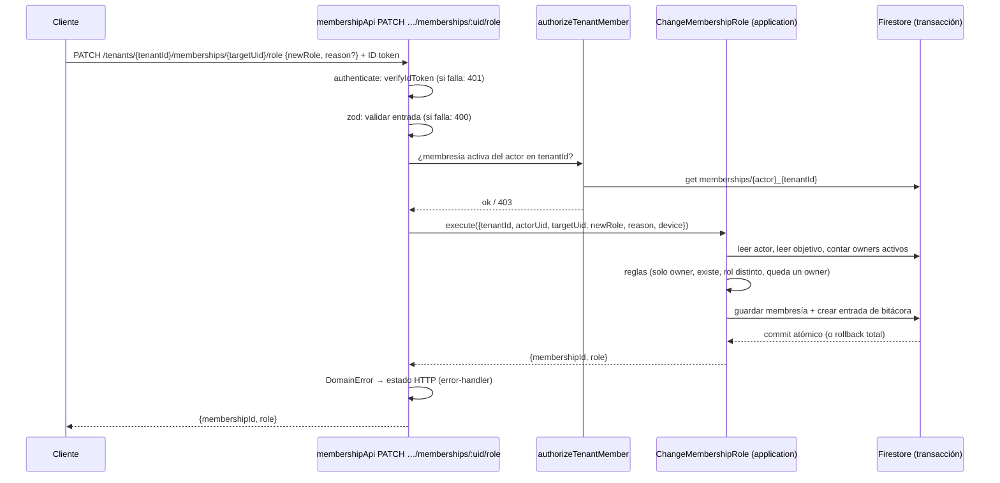

# Arquitectura del backend

Estado: refleja lo construido por las specs 01 (fundaciones), 02 (estructura de
la organización) y 03 (reestructura modular de `functions`), con el borde descrito
según el **ADR 0009** (una API HTTP con Express por módulo). El código todavía
expone 10 callables; la spec 04 las migra a las rutas de este documento. Hasta
entonces, donde esta doc dice "ruta" el código tiene una callable con el mismo caso
de uso. Las decisiones numeradas (D-xx) están en `plan-tecnico.md`; las de cada
spec, en `adr/`.

## Capas

Todo el código vive en `functions/src`, organizado **por módulo** (`audit`,
`membership`, `tenant`, `structure`) más `shared/` y `scripts/`. Cada módulo
tiene tres capas (ADR 0008):

```
┌──────────────────────────────────────────────────────────────┐
│ Cliente (escuelas-front): solo llama a las APIs HTTP         │
└──────────────────────────────┬───────────────────────────────┘
                               │ HTTPS + ID token de Firebase Auth
┌──────────────────────────────▼───────────────────────────────┐
│ <módulo>/infrastructure/http   (borde, Express)              │
│   token → zod → autorización por membresía → caso de uso     │
├──────────────────────────────────────────────────────────────┤
│ <módulo>/application   casos de uso + PUERTOS (interfaces)   │
│ <módulo>/domain        entidades y reglas puras              │
├──────────────────────────────────────────────────────────────┤
│ <módulo>/infrastructure/firestore  (implementan los puertos) │
└──────────────────────────────┬───────────────────────────────┘
                               │ Admin SDK
                          Firestore
```

| Capa | Contiene | Puede importar |
| --- | --- | --- |
| `domain` | entidades, validadores y funciones puras | `shared/domain` y el `domain` de otros módulos |
| `application` | casos de uso, puertos y sus dobles en memoria (`testing/`) | `domain` y `application` |
| `infrastructure` | adaptadores de Firestore, routers Express (`http/`), `authorize` | todo, incluidos Firebase y zod |

La dependencia apunta hacia adentro. Lo hace cumplir ESLint
(`no-restricted-imports` en `functions/.eslintrc.js`) y lo prueba
`shared/infrastructure/lint-boundaries.test.ts`: `domain` y `application` no
importan Firebase, `@google-cloud/*` ni `zod`, y ninguno importa `infrastructure`.
`shared/application/unit-of-work.ts` es la única excepción de composición (ADR 0008).

**Todo pasa por la API HTTP del módulo (D-03, ADR 0009).** Cada módulo expone una
sola Cloud Function `onRequest` (`membershipApi`, `tenantApi`, `structureApi`) con una
app Express adentro. Express vive solo en `infrastructure/http`; `domain` y
`application` no lo importan. El cliente nunca toca Firestore ni Storage:
`firestore.rules` y `storage.rules` son `allow read, write: if false`, y
`test:rules` lo demuestra con tres tipos de llamante sobre cada colección.

## Casos de uso y rutas

| API | Ruta | Caso de uso (`application`) | Quién | ADR |
| --- | --- | --- | --- | --- |
| `membershipApi` | `GET /me/memberships` | lectura pura (consulta en el adaptador) | cualquier sesión | 0002 |
| `membershipApi` | `PATCH /tenants/:tenantId/memberships/:uid/role` | `ChangeMembershipRole` | `owner` | 0004 |
| `tenantApi` | `PUT /tenants/:tenantId/profile` | `UpdateTenantProfile` | `owner` | 0007 |
| `structureApi` | `POST /tenants/:tenantId/venues`, `PUT …/venues/:id`, `PATCH …/venues/:id/status` | `SaveVenue`, `SetVenueStatus` | `owner` | 0007 |
| `structureApi` | las mismas tres rutas para `categories` | `SaveCategory`, `SetCategoryStatus` | `owner` | 0007 |
| `structureApi` | las mismas tres rutas para `groups` | `SaveGroup`, `SetGroupStatus` | `owner` | 0007 |
| `structureApi` | `GET /tenants/:tenantId/structure` | `visibleStructure` (función pura) sobre la lectura del tenant | por rol y alcance | 0007 |

Hoy el código las expone como las callables `listMyMemberships`,
`changeMembershipRole`, `updateTenantProfile`, `save*`, `set*Status` y
`getStructure`; la spec 04 las migra.

## Puertos y adaptadores

| Puerto (`application`) | Adaptador (`infrastructure/firestore`) | Doble de prueba (`application/testing`) |
| --- | --- | --- |
| `MembershipRepository` | `FirestoreMembershipRepository` | `InMemoryMembershipRepository` |
| `TenantRepository` | `FirestoreTenantRepository` | `InMemoryTenantRepository` |
| `VenueRepository`, `CategoryRepository`, `GroupRepository` (todos `StructureRepository<T>`) | `FirestoreStructureRepository<T>` + un mapper por entidad | `InMemoryStructureRepository<T>` |
| `AuditLogWriter` | `FirestoreAuditLogWriter` | `InMemoryAuditLogWriter` |
| `UnitOfWork` | `FirestoreUnitOfWork` (`runTransaction`) | `InMemoryUnitOfWork` (snapshot y rollback) |
| `Clock` | `systemClock` | `FakeClock` |

Cada puerto, su adaptador y su doble viven en su módulo; `UnitOfWork` y `Clock`
son de `shared`.

`UnitOfWork.run(work)` entrega a `work` repositorios **ligados a la
transacción** (`memberships`, `tenants`, `venues`, `categories`, `groups` y
`auditLog`): o se confirma todo (cambio + bitácora) o nada. Firestore exige leer
antes de escribir y puede reintentar la función, así que el trabajo no debe tener
efectos fuera del contexto recibido.

`StructureRepository<T>` expone `newId()`, `get`, `save` y `listByTenant`. No hay
búsquedas por nombre ni por padre: los casos de uso filtran `listByTenant` en
memoria (decenas de documentos por tenant, sin índices compuestos).

Los puertos de pagos y recibos (D-02, D-18, D-19) no existen todavía: se crean
en la Fase 2.

### Lecturas

- `GET /me/memberships` (hoy `listMyMemberships`) no pasa por el dominio: es una consulta de lectura
  (`membership/infrastructure/firestore/my-memberships-query.ts`).
- `GET /tenants/:tenantId/structure` (hoy `getStructure`) lee con `readStructure` (`structure/infrastructure/firestore/structure-query.ts`),
  descarta lo cerrado salvo `includeClosed`, aplica `visibleStructure` del dominio
  y devuelve DTO con fechas ISO 8601 en UTC y sin `tenantId`.

## Modelo de datos

```
memberships/{uid}_{tenantId}          # excepción a "todo bajo tenants/" (ADR 0002)
tenants/{tenantId}                    # ficha: name, status, idrdRegistration?, contact
tenants/{tenantId}/venues/{id}        # sedes
tenants/{tenantId}/categories/{id}    # categorías (birthYears opcional)
tenants/{tenantId}/groups/{id}        # grupos: una sola sede (venueId inmutable), horario
tenants/{tenantId}/auditLog/{id}      # solo creación
```

- Fechas en UTC (`Timestamp` en Firestore, `Date` en el dominio); Bogotá es solo presentación.
- Excepción: el horario de un grupo es **hora de pared** (`"HH:mm"`, día ISO 1–7),
  no un instante (ADR 0007).
- El `id` y el `tenantId` de sedes, categorías y grupos viven en la ruta, no en
  el documento.
- La bitácora se escribe con `create` sobre un id nuevo y `at` = hora del servidor.
- Nada se borra: sedes, categorías y grupos pasan a `closed`.

## Autorización (D-05, D-06)

No hay claims de tenant ni de rol. En cada petición:

1. El header `Authorization: Bearer <idToken>` debe traer un token válido (`401`).
2. El `tenantId` de la ruta **no se confía**: se lee `memberships/{uid}_{tenantId}`.
3. Sin membresía activa: `403` (mismo mensaje si no existe o está inactiva).
4. El caso de uso aplica las reglas de rol: las escrituras de estructura exigen
   `owner` (`requireOwner`); la ruta de estructura aplica la tabla de visibilidad.

Desactivar una membresía corta el acceso en la **siguiente** llamada, sin
revocar tokens.

### Visibilidad de `GET /tenants/:tenantId/structure`

| Rol | Ve |
| --- | --- |
| `owner`, `accountant` | Todo |
| `coordinator` | Sus sedes, los grupos de esas sedes y todas las categorías |
| `teacher` | Sus grupos, las sedes y categorías de esos grupos |
| `guardian`, `adultPlayer` | `403` |

Un `coordinator` o `teacher` con `scope` vacío ve todo vacío. Detalle en el ADR 0007.

## Flujo de punta a punta: `changeMembershipRole`



Reglas del caso de uso (ADR 0004): solo un `owner` activo del mismo tenant; el
objetivo debe existir en ese tenant; el rol nuevo debe diferir; el tenant
conserva al menos un `owner` activo. El `scope` se conserva.

Las escrituras de estructura (spec 02) siguen el mismo flujo, con tres
diferencias: el caso de uso lee sedes, categorías o grupos (no membresías
objetivo), la bitácora lleva `before`/`after` de la entidad, y cerrar o reabrir
revalida a los padres y a los hijos (por ejemplo, no se cierra una sede con
grupos activos).

## Errores

El cuerpo de todo error es `{error: {code, message}}` (ADR 0009).

| Error | Estado HTTP | Ejemplo |
| --- | --- | --- |
| sin token o token inválido | `401` | petición sin `Authorization` |
| `permission_denied` | `403` | un no-`owner` intenta escribir |
| `not_found` y ruta desconocida | `404` | la sede no existe en ese tenant |
| `failed_precondition` | `409` | nombre repetido; cerrar con hijos activos |
| `invalid_argument` | `400` | nombre en blanco; horario con `end <= start` |
| cualquier otro | `500` (mensaje genérico) | |

La forma de la entrada la rechaza zod en el borde (también `400`, con los nombres
de los campos y nunca sus valores); las reglas de negocio de los valores, el
dominio. Hoy, mientras exista el código con callables, el mapeo equivalente es
`toHttpsError`.

## Pruebas

| Suite | Qué prueba | Emulador |
| --- | --- | --- |
| `test:unit` | dominio y casos de uso con dobles, y las fronteras de capas | no |
| `test:rules` | Firestore y Storage deniegan todo al cliente, también en sedes, categorías y grupos | Firestore + Storage |
| `test:integration` | adaptadores, atomicidad, rutas de las APIs por HTTP, seed, alta de organización | Auth + Firestore + Functions |
| `smoke:dev` / `smoke:emulator` | APIs desplegadas (o locales) de punta a punta | Functions desplegadas / emuladores |

Los emuladores usan proyectos `demo-*`, sin acceso a la nube.

## Scripts de operación

| Comando | Qué hace |
| --- | --- |
| `npm run seed:emulator` / `seed:dev` | datos de prueba idempotentes (ADR 0005 y 0007) |
| `npm run tenant:create -- --target … --tenant-id … --name … --owner-email …` | alta de una organización con su dueño (ADR 0007) |

Se corren desde `functions/`. Ambos exigen `--target` y no existe `prod`.

## Empaquetado y despliegue

`functions/` es el único paquete npm y se empaqueta con esbuild a `lib/index.js`
(entrada `src/index.ts`; ADR 0008, que reemplaza al 0001). Los scripts de
operación no viajan al despliegue. Región `us-central1`
(ADR 0003). Este repo despliega `functions`, `firestore` y `storage`; el front
despliega solo hosting.
