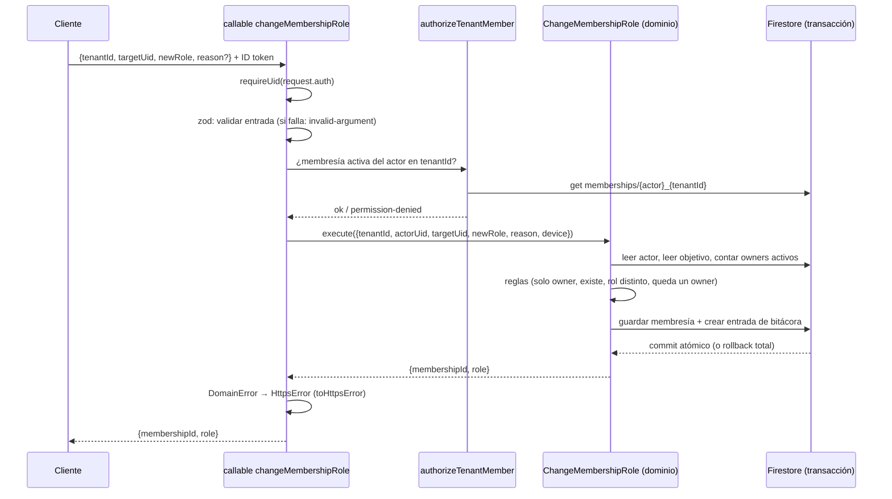

# Arquitectura del backend

Estado: refleja lo construido por las specs 01 (fundaciones) y 02 (estructura de
la organización). Las decisiones numeradas (D-xx) están en `plan-tecnico.md`; las
de cada spec, en `adr/`.

## Capas

```
┌──────────────────────────────────────────────────────────────┐
│ Cliente (escuelas-front): solo llama callables               │
└──────────────────────────────┬───────────────────────────────┘
                               │ HTTPS + ID token de Firebase Auth
┌──────────────────────────────▼───────────────────────────────┐
│ functions/src/callables/*   (borde)                          │
│   sesión → zod → autorización por membresía → caso de uso    │
├──────────────────────────────────────────────────────────────┤
│ packages/domain             (negocio puro, sin Firebase)     │
│   casos de uso + reglas + PUERTOS (interfaces)               │
├──────────────────────────────────────────────────────────────┤
│ functions/src/adapters/firestore/   (implementan los puertos)│
└──────────────────────────────┬───────────────────────────────┘
                               │ Admin SDK
                          Firestore
```

La dependencia apunta hacia adentro: `functions` conoce al dominio; el dominio
no conoce a nadie. Lo hace cumplir ESLint (`packages/domain/.eslintrc.js`).

**Todo es una callable (D-03).** El cliente nunca toca Firestore ni Storage:
`firestore.rules` y `storage.rules` son `allow read, write: if false`, y
`test:rules` lo demuestra con tres tipos de llamante sobre cada colección.

## Casos de uso y callables

| Callable | Caso de uso (dominio) | Quién | ADR |
| --- | --- | --- | --- |
| `listMyMemberships` | lectura pura (consulta en el adaptador) | cualquier sesión | 0002 |
| `changeMembershipRole` | `ChangeMembershipRole` | `owner` | 0004 |
| `updateTenantProfile` | `UpdateTenantProfile` | `owner` | 0007 |
| `saveVenue`, `setVenueStatus` | `SaveVenue`, `SetVenueStatus` | `owner` | 0007 |
| `saveCategory`, `setCategoryStatus` | `SaveCategory`, `SetCategoryStatus` | `owner` | 0007 |
| `saveGroup`, `setGroupStatus` | `SaveGroup`, `SetGroupStatus` | `owner` | 0007 |
| `getStructure` | `visibleStructure` (función pura) sobre la lectura del tenant | por rol y alcance | 0007 |

## Puertos y adaptadores

| Puerto (dominio) | Adaptador (functions) | Doble de prueba (dominio) |
| --- | --- | --- |
| `MembershipRepository` | `FirestoreMembershipRepository` | `InMemoryMembershipRepository` |
| `TenantRepository` | `FirestoreTenantRepository` | `InMemoryTenantRepository` |
| `VenueRepository`, `CategoryRepository`, `GroupRepository` (todos `StructureRepository<T>`) | `FirestoreStructureRepository<T>` + un mapper por entidad | `InMemoryStructureRepository<T>` |
| `AuditLogWriter` | `FirestoreAuditLogWriter` | `InMemoryAuditLogWriter` |
| `UnitOfWork` | `FirestoreUnitOfWork` (`runTransaction`) | `InMemoryUnitOfWork` (snapshot y rollback) |
| `Clock` | `systemClock` | `FakeClock` |

`UnitOfWork.run(work)` entrega a `work` repositorios **ligados a la
transacción** (`memberships`, `tenants`, `venues`, `categories`, `groups` y
`auditLog`): o se confirma todo (cambio + bitácora) o nada. Firestore exige leer
antes de escribir y puede reintentar la función, así que el trabajo no debe tener
efectos fuera del contexto recibido.

`StructureRepository<T>` expone `newId()`, `get`, `save` y `listByTenant`. No hay
búsquedas por nombre ni por padre: los casos de uso filtran `listByTenant` en
memoria (decenas de documentos por tenant, sin índices compuestos).

Los puertos de pagos y recibos (D-02, D-18, D-19) no existen todavía: se crean
en la Fase 2.

### Lecturas

- `listMyMemberships` no pasa por el dominio: es una consulta de lectura
  (`adapters/firestore/my-memberships-query.ts`).
- `getStructure` lee con `readStructure` (`adapters/firestore/structure-query.ts`),
  descarta lo cerrado salvo `includeClosed`, aplica `visibleStructure` del dominio
  y devuelve DTO con fechas ISO 8601 en UTC y sin `tenantId`.

## Modelo de datos

```
memberships/{uid}_{tenantId}          # excepción a "todo bajo tenants/" (ADR 0002)
tenants/{tenantId}                    # ficha: name, status, idrdRegistration?, contact
tenants/{tenantId}/venues/{id}        # sedes
tenants/{tenantId}/categories/{id}    # categorías (birthYears opcional)
tenants/{tenantId}/groups/{id}        # grupos: una sola sede (venueId inmutable), horario
tenants/{tenantId}/auditLog/{id}      # solo creación
```

- Fechas en UTC (`Timestamp` en Firestore, `Date` en el dominio); Bogotá es solo presentación.
- Excepción: el horario de un grupo es **hora de pared** (`"HH:mm"`, día ISO 1–7),
  no un instante (ADR 0007).
- El `id` y el `tenantId` de sedes, categorías y grupos viven en la ruta, no en
  el documento.
- La bitácora se escribe con `create` sobre un id nuevo y `at` = hora del servidor.
- Nada se borra: sedes, categorías y grupos pasan a `closed`.

## Autorización (D-05, D-06)

No hay claims de tenant ni de rol. En cada llamada:

1. `request.auth` debe existir (`unauthenticated`).
2. El `tenantId` del cliente **no se confía**: se lee `memberships/{uid}_{tenantId}`.
3. Sin membresía activa: `permission-denied` (mismo mensaje si no existe o está inactiva).
4. El caso de uso aplica las reglas de rol: las escrituras de estructura exigen
   `owner` (`requireOwner`); `getStructure` aplica la tabla de visibilidad.

Desactivar una membresía corta el acceso en la **siguiente** llamada, sin
revocar tokens.

### Visibilidad de `getStructure`

| Rol | Ve |
| --- | --- |
| `owner`, `accountant` | Todo |
| `coordinator` | Sus sedes, los grupos de esas sedes y todas las categorías |
| `teacher` | Sus grupos, las sedes y categorías de esos grupos |
| `guardian`, `adultPlayer` | `permission-denied` |

Un `coordinator` o `teacher` con `scope` vacío ve todo vacío. Detalle en el ADR 0007.

## Flujo de punta a punta: `changeMembershipRole`



Reglas del caso de uso (ADR 0004): solo un `owner` activo del mismo tenant; el
objetivo debe existir en ese tenant; el rol nuevo debe diferir; el tenant
conserva al menos un `owner` activo. El `scope` se conserva.

Las escrituras de estructura (spec 02) siguen el mismo flujo, con tres
diferencias: el caso de uso lee sedes, categorías o grupos (no membresías
objetivo), la bitácora lleva `before`/`after` de la entidad, y cerrar o reabrir
revalida a los padres y a los hijos (por ejemplo, no se cierra una sede con
grupos activos).

## Errores

| Error de dominio | `HttpsError` | Ejemplo |
| --- | --- | --- |
| `permission_denied` | `permission-denied` | un no-`owner` intenta escribir |
| `not_found` | `not-found` | la sede no existe en ese tenant |
| `failed_precondition` | `failed-precondition` | nombre repetido; cerrar con hijos activos |
| `invalid_argument` | `invalid-argument` | nombre en blanco; horario con `end <= start` |
| cualquier otro | `internal` (mensaje genérico) | |

La forma de la entrada la rechaza zod en el borde (también `invalid-argument`);
las reglas de negocio de los valores, el dominio.

## Pruebas

| Suite | Qué prueba | Emulador |
| --- | --- | --- |
| `test:domain` | reglas del dominio con dobles | no |
| `test:rules` | Firestore y Storage deniegan todo al cliente, también en sedes, categorías y grupos | Firestore + Storage |
| `test:integration` | adaptadores, atomicidad, callables por HTTP, seed, alta de organización | Auth + Firestore + Functions |
| `smoke:dev` / `smoke:emulator` | callables desplegadas (o locales) de punta a punta | Functions desplegadas / emuladores |

Los emuladores usan proyectos `demo-*`, sin acceso a la nube.

## Scripts de operación

| Comando | Qué hace |
| --- | --- |
| `npm run seed:emulator` / `seed:dev` | datos de prueba idempotentes (ADR 0005 y 0007) |
| `npm run tenant:create -- --target … --tenant-id … --name … --owner-email …` | alta de una organización con su dueño (ADR 0007) |

Ambos exigen `--target` y no existe `prod`.

## Empaquetado y despliegue

`functions/` empaqueta el dominio con esbuild (ADR 0001). Región `us-central1`
(ADR 0003). Este repo despliega `functions`, `firestore` y `storage`; el front
despliega solo hosting.
