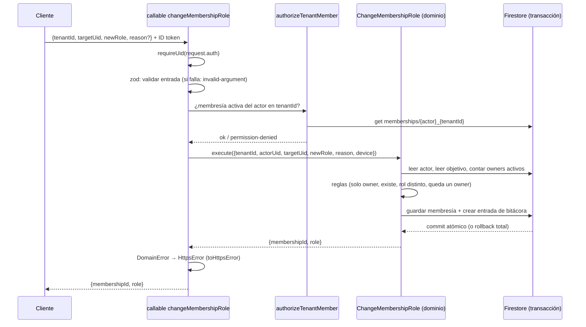

# Arquitectura del backend

Estado: refleja lo construido por la spec 01 (fundaciones). Las decisiones
numeradas (D-xx) están en `plan-tecnico.md`; las de esta spec, en `adr/`.

## Capas

```
┌──────────────────────────────────────────────────────────────┐
│ Cliente (escuelas-front): solo llama callables               │
└──────────────────────────────┬───────────────────────────────┘
                               │ HTTPS + ID token de Firebase Auth
┌──────────────────────────────▼───────────────────────────────┐
│ functions/src/callables/*   (borde)                          │
│   sesión → zod → autorización por membresía → caso de uso    │
├──────────────────────────────────────────────────────────────┤
│ packages/domain             (negocio puro, sin Firebase)     │
│   casos de uso + reglas + PUERTOS (interfaces)               │
├──────────────────────────────────────────────────────────────┤
│ functions/src/adapters/firestore/   (implementan los puertos)│
└──────────────────────────────┬───────────────────────────────┘
                               │ Admin SDK
                          Firestore
```

La dependencia apunta hacia adentro: `functions` conoce al dominio; el dominio
no conoce a nadie. Lo hace cumplir ESLint (`packages/domain/.eslintrc.js`).

**Todo es una callable (D-03).** El cliente nunca toca Firestore ni Storage:
`firestore.rules` y `storage.rules` son `allow read, write: if false`, y
`test:rules` lo demuestra con tres tipos de llamante.

## Puertos y adaptadores

| Puerto (dominio) | Adaptador (functions) | Doble de prueba (dominio) |
| --- | --- | --- |
| `MembershipRepository` | `FirestoreMembershipRepository` | `InMemoryMembershipRepository` |
| `AuditLogWriter` | `FirestoreAuditLogWriter` | `InMemoryAuditLogWriter` |
| `UnitOfWork` | `FirestoreUnitOfWork` (`runTransaction`) | `InMemoryUnitOfWork` (snapshot y rollback) |
| `Clock` | `systemClock` | `FakeClock` |

`UnitOfWork.run(work)` entrega a `work` repositorios **ligados a la
transacción**: o se confirma todo (cambio + bitácora) o nada. Firestore exige
leer antes de escribir y puede reintentar la función, así que el trabajo no debe
tener efectos fuera del contexto recibido.

Los puertos de pagos y recibos (D-02, D-18, D-19) no existen todavía: se crean
en la Fase 2.

### Lecturas puras

`listMyMemberships` no pasa por el dominio: es una consulta de lectura
(`adapters/firestore/my-memberships-query.ts`) que une las membresías activas
del usuario con el nombre del tenant. Si algún día gana reglas de negocio, se
promueve a caso de uso.

## Modelo de datos

```
memberships/{uid}_{tenantId}          # excepción a "todo bajo tenants/" (ADR 0002)
tenants/{tenantId}
tenants/{tenantId}/auditLog/{id}      # solo creación
```

- Fechas en UTC (`Timestamp` en Firestore, `Date` en el dominio); Bogotá es solo presentación.
- La bitácora se escribe con `create` sobre un id nuevo y `at` = hora del servidor.

## Autorización (D-05, D-06)

No hay claims de tenant ni de rol. En cada llamada:

1. `request.auth` debe existir (`unauthenticated`).
2. El `tenantId` del cliente **no se confía**: se lee `memberships/{uid}_{tenantId}`.
3. Sin membresía activa: `permission-denied` (mismo mensaje si no existe o está inactiva).
4. El caso de uso aplica las reglas de rol.

Desactivar una membresía corta el acceso en la **siguiente** llamada, sin
revocar tokens.

## Flujo de punta a punta: `changeMembershipRole`



Reglas del caso de uso (ADR 0004): solo un `owner` activo del mismo tenant; el
objetivo debe existir en ese tenant; el rol nuevo debe diferir; el tenant
conserva al menos un `owner` activo. El `scope` se conserva.

| Error de dominio | `HttpsError` |
| --- | --- |
| `permission_denied` | `permission-denied` |
| `not_found` | `not-found` |
| `failed_precondition` | `failed-precondition` |
| cualquier otro | `internal` (mensaje genérico) |

## Pruebas

| Suite | Qué prueba | Emulador |
| --- | --- | --- |
| `test:domain` | reglas del dominio con dobles | no |
| `test:rules` | Firestore y Storage deniegan todo al cliente | Firestore + Storage |
| `test:integration` | adaptadores, atomicidad, callables por HTTP, seed | Auth + Firestore + Functions |

Los emuladores usan proyectos `demo-*`, sin acceso a la nube.

## Empaquetado y despliegue

`functions/` empaqueta el dominio con esbuild (ADR 0001). Región `us-central1`
(ADR 0003). Este repo despliega `functions`, `firestore` y `storage`; el front
despliega solo hosting.
